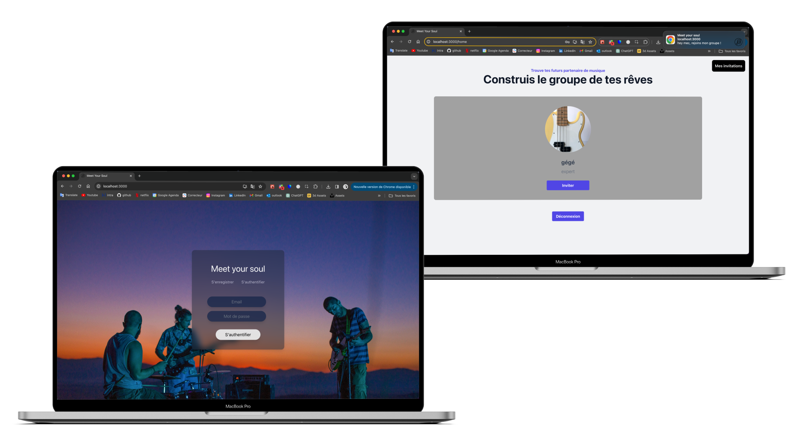
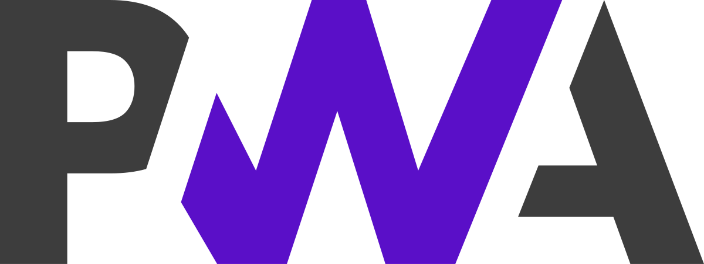
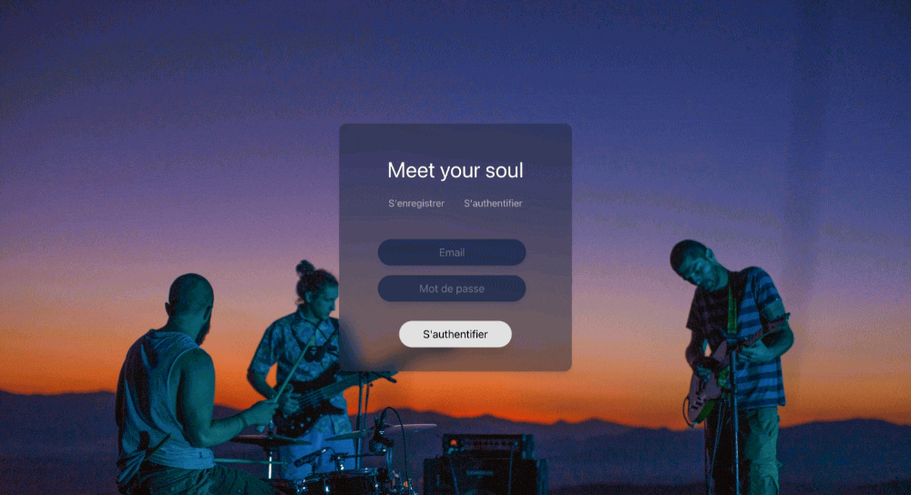
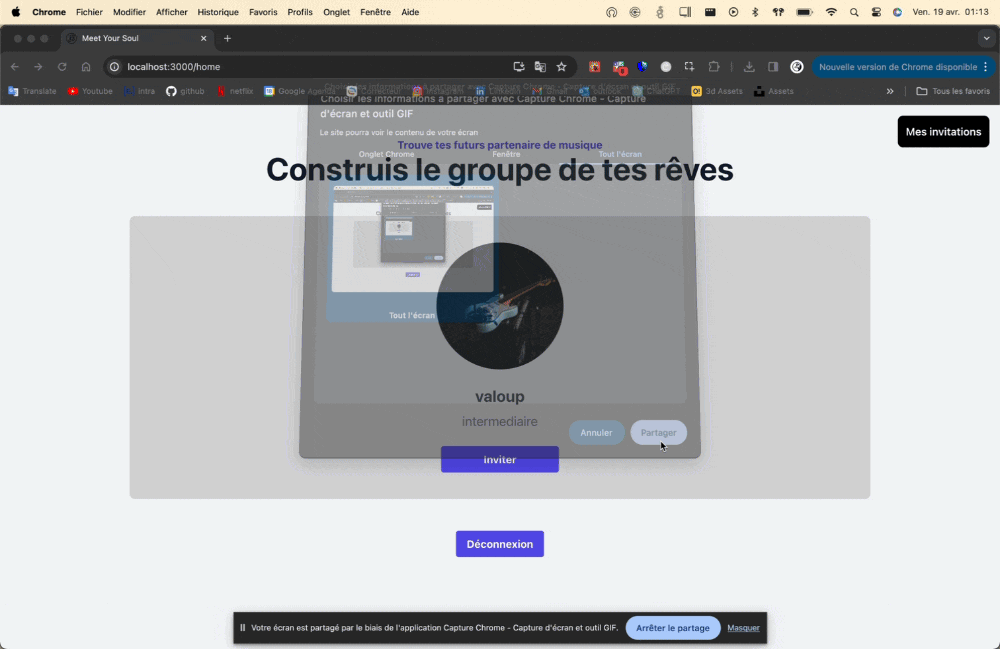

<h1 align="center"> 🔔 Meet your soul PWA 🎶 </h1>  

    

  Une simple application destinée aux musiciens afin de créer des groupes avec différentes personnes, selon leur instrument et leur niveau.

---

## 🤔 C'est quoi une PWA ❓

#### 🌐 Qu'est-ce qu'une PWA ?
Une Progressive Web App (PWA) est une application web conçue pour offrir une expérience utilisateur optimale 🚀.
Elle tire parti des dernières technologies pour permettre un chargement rapide ⚡, une grande réactivité 🔄 et la possibilité de 
fonctionner hors ligne ou sur des réseaux de faible qualité 📶. Les PWA sont conçues pour être sécurisées 🔒, fiables 💪 et engageantes 🤝, 
permettant ainsi une interaction plus naturelle et intégrée sur l'appareil de l'utilisateur.
 
 

    

#### 🔧 Comment ça fonctionne ?
Ma PWA utilise React JS pour créer une interface utilisateur interactive et dynamique 🖥️. Grâce à React, je peux mettre à jour le contenu de 
manière efficace et rendre l'expérience utilisateur plus agréable et réactive 🌟. Le backend est géré par Node JS, offrant une plateforme robuste pour 
les opérations côté serveur, y compris la gestion des requêtes API, la manipulation des données, et la logique métier ⚙️.

Le projet est structuré pour tirer parti des service workers, qui jouent un rôle clé dans les capacités hors ligne des PWA 📡. Ces scripts 
s'exécutent en arrière-plan, permettant le caching des ressources et la gestion des requêtes de données, ce qui améliore considérablement 
la performance et l'expérience utilisateur en conditions de réseau limité 🌐.

---

## 👨🏽‍💻 Mon projet

#### 🎶 Présentation
Bienvenue sur l'application Meet your soul 🌐, une plateforme spécialement conçue pour les musiciens désireux de former des groupes et de collaborer avec d'autres artistes 🎸🥁. Cette application facilite la rencontre et la collaboration entre musiciens de différents niveaux et spécialisations instrumentales, rendant la création de synergies musicales à la fois simple et enrichissante.

#### 🔗 Fonctionnalités
Au cœur de l'application, chaque fonctionnalité est pensée pour faciliter chaque étape de votre parcours musical 🎼. Dès l'inscription, chaque utilisateur peut créer un profil, y indiquant son instrument de prédilection et son niveau de compétence 🎷. Les utilisateurs ont ensuite accès à une liste complète d'autres musiciens, favorisant des connexions précises et pertinentes. La fonctionnalité d'invitations personnalisées permet d'envoyer des invitations pour rejoindre ou former un groupe, avec des notifications en temps réel propulsées par les capacités de la PWA, même si l'autre utilisateur n'est pas en ligne 💌. La gestion des invitations, acceptées ou refusées, est également intuitive, permettant une interaction fluide et simple entre les utilisateur

---

## 🖥️ Ma solution

---

---

## 👨🏻‍🏫 Le sujet Epitech

#### 🚀 Objectif :
 - Le projet consiste à développer une Progressive Web App (PWA) qui offre une expérience utilisateur optimale sur différents appareils et conditions de réseau.
 - Cette PWA doit être rapide, réactive et accessible hors ligne grâce à des techniques de pointe en matière de développement web.

#### 🔍 Portée du Projet :
 - Ce projet vise à créer une PWA qui s'adapte à diverses tailles d'écran et appareils, en offrant une expérience utilisateur fluide et réactive.
 - Il comprend la personnalisation de l'interface, l'optimisation des performances de chargement et l'utilisation de service workers pour une fonctionnalité hors ligne.

#### 🗝️ Caractéristiques Clés :
 - **Adaptabilité et Réactivité** : Conception responsive pour mobiles, tablettes et desktops.
 - **Personnalisation du Manifeste** : Mise à jour du nom de l'application et des icônes par défaut.
 - **Chargement Rapide** : Optimisation du temps de chargement initial et utilisation de techniques de mise en cache.
 - **Service Worker** : Implémentation d'un service worker pour le cache des ressources statiques et le fonctionnement hors ligne.
 - **Sécurité** : Utilisation du protocole HTTPS pour protéger les communications et assurer l'intégrité des données.
 - **Expérience Utilisateur (UX)** : Analyse ergonomique pour une expérience utilisateur supérieure, y compris la gestion des interactions en mode hors ligne.
 - **Compatibilité entre Navigateurs** : Fonctionnement correct de l'application sur divers navigateurs.
 - **Gestion des Mises à Jour et Version Hors Ligne** : Notifications pour informer les utilisateurs des mises à jour disponibles.
 - **Performance du Réseau** : Gestion des interruptions de réseau et des connexions instables.
 - **Analyse de Performance** : Utilisation d'outils pour évaluer le temps de chargement, l'efficacité du cache et l'usage du processeur.
 - **Notifications Push** : Envoi de notifications push pertinentes et non-intrusives.
 - **Stratégies de Cache** : Optimisation de l'utilisation du cache pour améliorer la performance et l'expérience hors ligne.

#### 📘 Livrable :
 - Une PWA pleinement fonctionnelle déployée avec une documentation complète pour les utilisateurs.
 - Des documents architecturaux expliquant la structure et la conception du projet.

---

## 🈵 Les technos
 

  
  
  
  

 

J'ai choisi de créer un service worker en vanilla JS pour bien comprendre les enjeux et les foncitonnalités de la pwa, ainsi qu'un front en react js et un back en node totalement sécurisé.

